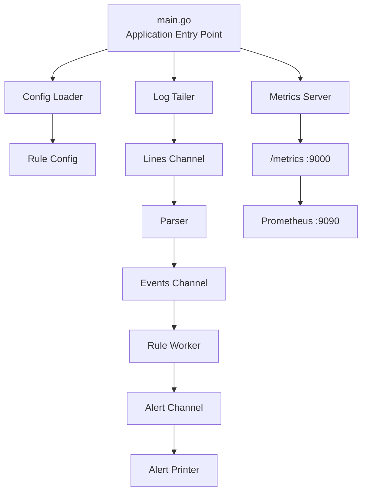

# LogRadar

A Go-based security monitoring service that continuously tails application logs, parses events, detects suspicious activity using configurable rules, and exposes monitoring metrics through Prometheus.

---

## Purpose

LogRadar is a **learning-depth portfolio project** designed to build practical understanding of backend systems, concurrent event processing, security monitoring, configuration-driven applications, observability, and containerization.

---

## Detailed Information

### Phase 1 - Log Ingestion

LogRadar continuously monitors an application log file for newly appended entries.

A dedicated Go goroutine runs the log tailing process and reads new lines as they are added to the file. Each raw log line is sent through a Go channel for further processing.

**Key concepts:**
- File handling with Go
- Continuous log monitoring
- `bufio.Scanner`
- Goroutines
- Go channels

---

### Phase 2 — Event Parsing

Raw log lines are received as JSON strings and converted into structured `LogEvent` objects.

Each event contains information such as:

```text
Timestamp
Source IP
Event Type
Username
Status
```

The parser validates and converts incoming JSON into a format that can be processed by the rule engine.

**Flow:**

```text
Raw JSON Log
     ↓
JSON Parser
     ↓
LogEvent
```

---

### Phase 3 — Rule Engine

Parsed events are passed to the rule-processing system.

LogRadar currently implements a configurable **brute-force detection rule** that tracks failed login attempts from the same source and evaluates them against a configured threshold and time window.

For example:

```yaml
threshold: 5
window: 30s
```

means that five failed login attempts within 30 seconds can trigger a detection.

The rule system is separated from the parser so detection logic can be extended independently.

---

### Phase 4 — Alerting

When a detection rule is triggered, LogRadar creates an alert containing information about the detected activity.

Alerts are passed through an alert channel and handled by the alert printer.

**Flow:**

```text
LogEvent
   ↓
Rule Worker
   ↓
Detection Rule
   ↓
Alert
   ↓
Alert Channel
   ↓
Alert Printer
```

This keeps detection processing separate from alert output.

---

### Phase 5 — Prometheus Metrics

LogRadar exposes application metrics through an HTTP `/metrics` endpoint.

The metrics endpoint runs on:

```text
localhost:9000/metrics
```

Prometheus runs separately and uses its configuration to scrape this endpoint.

Prometheus itself runs on:

```text
localhost:9090
```

Currently tracked metrics include:

```text
logradar_events_processed_total
logradar_alerts_triggered_total
```

This provides visibility into the number of processed events and triggered detections.

---

### Phase 6 — Configuration

Detection settings are externalized into a YAML configuration file instead of being hardcoded into the detection logic.

Example:

```yaml
brute_force:
  threshold: 5
  window: 30s
```

The configuration loader reads these values when LogRadar starts.

This allows detection behavior to be modified without changing the Go source code.

---

### Phase 7 — Testing

The project includes tests for important application components such as parsing, configuration loading, and detection rules.

Testing focuses on verifying that individual components behave correctly and that detection logic produces the expected results for different event patterns.

---

### Phase 8 — Docker

LogRadar is containerized using Docker.

The application can run inside a container while exposing its metrics endpoint on port `9000`.

Prometheus can then scrape the containerized LogRadar service through the configured Docker networking setup.

The resulting monitoring flow is:

```text
LogRadar Container
       │
       │ :9000
       ▼
   Prometheus
       │
       │ :9090
       ▼
 Prometheus UI
```

---

## Architecture



---

## Core Data Flow

```text
Application Log
       ↓
Log Tailer
       ↓
Raw Log Channel
       ↓
JSON Parser
       ↓
LogEvent
       ↓
Events Channel
       ↓
Rule Worker
       ↓
Detection Rule
       ↓
Alert
       ↓
Alert Channel
       ↓
Alert Printer
```

At the same time, LogRadar records application metrics:

```text
Events / Alerts
       ↓
Prometheus Metrics
       ↓
/metrics :9000
       ↓
Prometheus :9090
```

---

## Tech Stack

- **Go** — Core application language, concurrency, event processing, rule engine, configuration handling, and HTTP metrics endpoint
- **Prometheus** — Scrapes and stores LogRadar application metrics
- **Docker** — Containerizes LogRadar and provides the runtime environment

---

## Project Structure

```text
## Project Structure

```text
LogRadar/
├── cmd/
│   └── logradar/
│       └── main.go                  # Application entry point and component orchestration
│
├── internal/
│   ├── alerting/
│   │   └── printer.go               # Prints triggered alerts
│   │
│   ├── config/
│   │   ├── config.go                # Loads application configuration
│   │   └── config_test.go           # Configuration tests
│   │
│   ├── metrics/
│   │   └── metrics.go               # Prometheus metrics and /metrics endpoint
│   │
│   ├── parser/
│   │   ├── parser.go                # Converts JSON logs into LogEvent objects
│   │   └── parser_test.go           # Parser tests
│   │
│   ├── rules/
│   │   ├── brute_force.go            # Brute-force detection logic
│   │   ├── detector_test.go          # Detection rule tests
│   │   ├── rules.go                  # Rule and Alert definitions
│   │   └── workers.go                # Concurrent rule worker
│   │
│   └── tailer/
│       └── tailer.go                # Continuously reads new log entries
│
├── configs/
│   └── configs.yml                  # Detection configuration
│
├── logs/
│   ├── example_sam_log.txt          # Example log data
│   └── sample.log                   # Sample application log
│
├── Dockerfile                       # LogRadar container definition
├── docker-compose.yml               # LogRadar and Prometheus services
├── prometheus.yml                   # Prometheus scrape configuration
│
├── data/                            # Prometheus local storage
│   ├── chunks/
│   ├── index/
│   ├── wal/
│   └── ...
│
├── commands.txt                     # Useful project commands
├── structure_of_project.txt         # Project structure reference
├── go.mod                           # Go module definition
├── go.sum                           # Go dependency checksums
├── LICENSE
└── README.md
```

### Component Roles

**`main.go`**  
Acts as the application entry point. It initializes configuration, channels, processing components, detection rules, alerting, and the metrics server.

**`internal/`**  
Contains the core LogRadar application components.

**`configs/`**  
Stores configurable detection parameters separately from the Go source code.

**`logs/`**  
Contains the log files used as input for LogRadar.

**`Dockerfile`**  
Defines how the LogRadar Go application is packaged into a Docker image.

**`docker-compose.yml`**  
Defines the containerized services and their networking configuration.

**`prometheus.yml`**  
Defines how Prometheus discovers and scrapes LogRadar's `/metrics` endpoint.

**`data/`**  
Contains Prometheus's locally stored monitoring data, including its time-series database files and write-ahead log.

**`tests`**  
Testing is currently organized alongside the components inside `internal/` using Go's `_test.go` convention rather than a separate top-level test directory.
```

---

## Configurations

Detection behavior is configured through:

```text
configs/configs.yml
```

Example:

```yaml
brute_force:
  threshold: 5
  window: 30s
```

### Configuration fields

| Field | Purpose |
|---|---|
| `threshold` | Number of failed attempts required to trigger detection |
| `window` | Time period in which attempts are evaluated |

Changing the configuration allows detection behavior to be adjusted without modifying the detection implementation.

---

## Prometheus Metrics

LogRadar exposes its metrics through:

```text
http://localhost:9000/metrics
```

Port **9000** belongs to the LogRadar application and serves the `/metrics` endpoint.

Prometheus runs on:

```text
http://localhost:9090
```

Port **9090** belongs to the Prometheus server and provides the Prometheus interface and query system.

### Current Metrics

```text
logradar_events_processed_total
logradar_alerts_triggered_total
```

The relationship between the two services is:

```text
LogRadar :9000
     │
     │ /metrics
     ▼
Prometheus :9090
```

Prometheus periodically scrapes the metrics exposed by LogRadar and makes the collected data available for querying.

---

## Learning Focus

LogRadar focuses on practical understanding of:

### Go

```text
Goroutines
Channels
Worker patterns
Structs
Interfaces
Error handling
Concurrency
File handling
JSON parsing
Configuration loading
HTTP servers
```

### Backend & Systems

```text
Continuous log ingestion
Event-driven processing
Rule-based detection
Concurrent workers
Configuration-driven applications
Application observability
```

### Monitoring

```text
Prometheus metrics
Metric counters
HTTP /metrics endpoint
Metrics scraping
```

### Containerization

```text
Docker
Containerized Go applications
Container networking
Service-to-service communication
```

---

## Future Scope

Possible extensions to LogRadar include:

- Additional security detection rules
- Multiple log-file and log-source support
- More detailed security metrics
- Advanced alert delivery mechanisms
- Webhook and notification integrations
- Anomaly detection
- Machine-learning-based detection
- Web-based monitoring interface
- More extensive integration and load testing
- Expanded containerized deployment architecture
